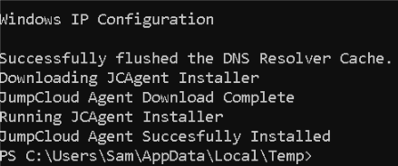

# Setup Guide

## Prerequisites
- JumpCloud account (free trial available)
- Python 3.8+
- Virtual machines or physical devices for testing

## Quick Start

### 1. Clone Repository
\```bash
git clone https://github.com/sammiet03/endpoint-security-lab.git
cd endpoint-security-lab
\```

### 2. Install Dependencies
\```bash
pip install -r requirements.txt
\```

### 3. Configure Environment
\```bash
# Copy example environment file
cp .env.example .env

# Edit .env and add your JumpCloud API key
nano .env
\```

### 4. Run Health Monitor
\```bash
python scripts/device_health_monitor.py
\```

## JumpCloud Setup

### Get API Key
1. Log into JumpCloud console
2. Click your name → "My API Key"
3. Generate new API key
4. Copy to `.env` file

### Enroll Devices

**On Windows VM:**
### Open PowerShell as Administrator (right-click → Run as Administrator)

### Get your Connect Key from JumpCloud
### Console → Device Management → Windows → "Enroll Device" → Copy the command

\```powershell
Invoke-Expression (Invoke-RestMethod -Uri 'https://kickstart.jumpcloud.com/Kickstart' -UseBasicParsing)
\```




**Linux:**
\```bash
curl --tlsv1.2 --silent --show-error --header 'x-connect-key: YOUR_KEY' https://kickstart.jumpcloud.com/Kickstart | sudo bash
\```

## Troubleshooting

### API Connection Issues
- Verify API key is correct
- Check network connectivity
- Ensure `.env` file exists

### Device Not Appearing
- Wait 2-3 minutes after enrollment
- Check agent is running
- Verify Connect Key was correct

## Security Notes
- Never commit `.env` file
- Rotate API keys regularly
- Use least privilege access
- Enable MFA on JumpCloud account